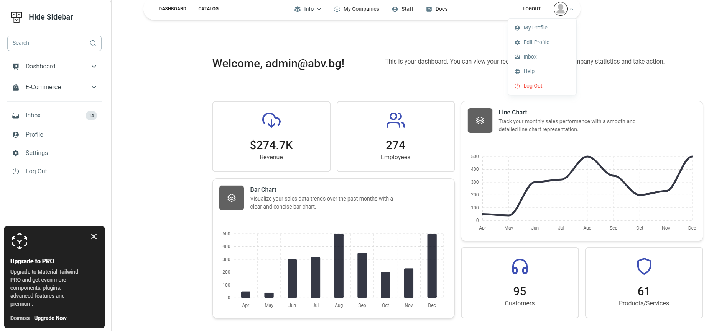
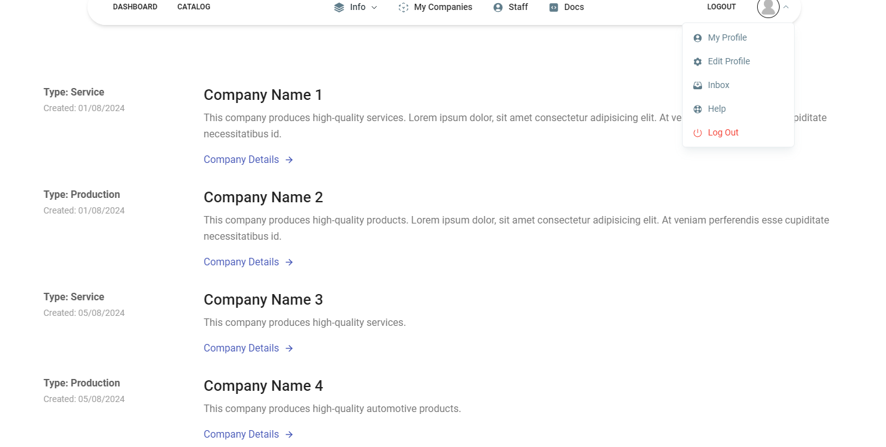
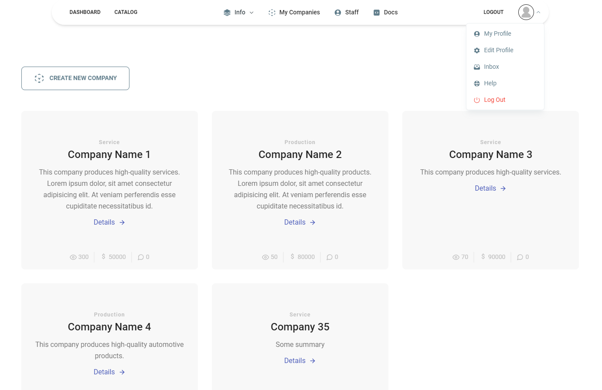

# Personal-Dashboard
## Project Defense - ReactJS Course July 2024 - https://softuni.bg/trainings/4529/reactjs-june-2024
## Project Description
### The project is developed with basic functionalities in focus on company management, data visualization and business strategies.  

 

## Dashboard view
 

 
 
 

## Catalog view:

 
 
 

## My Companies View view:

 
 
 

# You can start the project locally by following these steps:
## 1. Download the repo on your computer
## 2. Open the project with VSCode or other IDE
  - navigate to server folder and start server
      * terminal --> cd server
      * terminal --> node server.js
  - in new terminal navigate to client folder
      * terminal --> cd client
    - install dependencies
      * terminal --> npm install
    - start client
      * terminal --> npm run dev
  - open the client in browser
    * browser --> http://localhost:5173/

 
 
 

## Development plan:

## 1. Initialize Project
- [x] Initialize git repo
- [x] Add student practice server
- [x] Add base Vite react project as client
- [x] cleanup Client

## 2. React Router
- [x] Install react-router-dom
- [x] Install Tailwind React
- [x] Install Tailwind components depedencies
- [x] Setup react-router-dom
- [x] Add routes in App.jsx
- [x] Add links in navigation

## 3. Create Sevice Layer
- [x] Service Layer Architecture discussion
- [x] Abstract requester
- [x] Register User api
- [x] Preseed Practice server

## 4. Page Implementations
- [x] Home - Dhasboard
  - [x] Add Dashboard Header navigation
  - [x] Add Dashboard side bar navigation 
  - [x] Not Logged User
  - [x] Logged User
  - [x] Add Footer
- [x] Register Form
- [x] Login Form
- [x] Logout
- [x] User Details Page
- [x] Add About Us Page
- [x] Add Contacts Page

## 5. Company Functionalities
- [x] Create Company Page
- [x] List Owned Companies
- [x] List All Companies
- [x] Edit Company Page
  - [x] Input data validation
  - [x] Confirmation dialog
- [x] Delete Company Page
  - [x] Confirmation dialog
